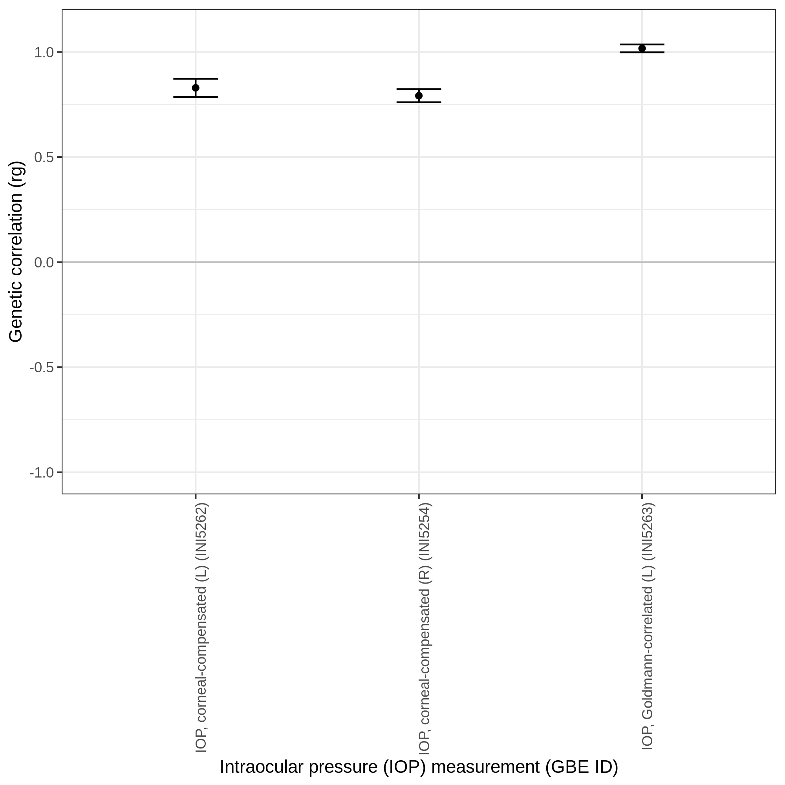

# Genetic correlation analysis.

Using LD score regression, we performed the genetic correlation analysis.

Here, we aggregated the estimated genetic correlations (`rg`) in [`ANGPTL7.tsv`](ANGPTL7.tsv) and plotted them using [`IOP-rg.ipynb`](IOP-rg.ipynb).
The resulting files are in [`ANGPTL7.png`](ANGPTL7.png) and [`ANGPTL7.pdf`](ANGPTL7.pdf).

We also applied a [similar analysis](/notebook/ukbb_GCTA/GCTA_HEreg_bivar.summary.tsv) using bivariate GREML implemented in GCTA.
